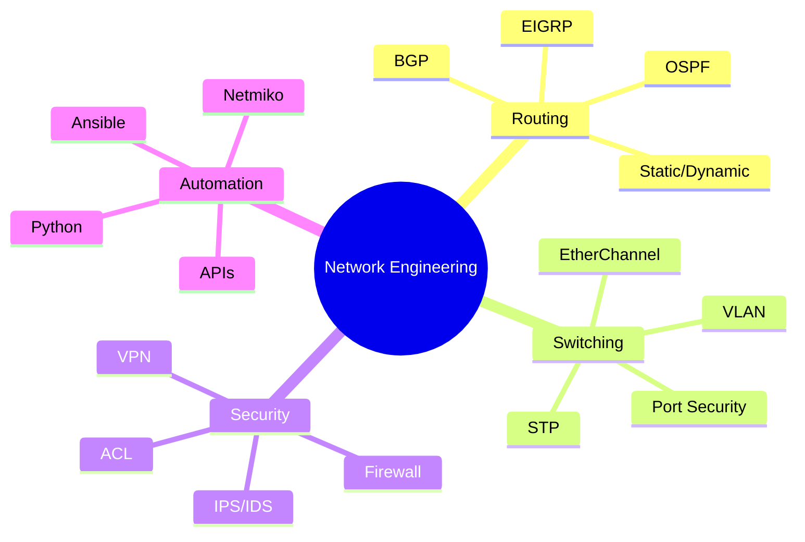

<div align="center">
  
</div>

<div align="center">
  
  [](https://git.io/typing-svg)
  
</div>

<div align="center">
  
  ### 🎓 Computer Engineering Student @ Institut Teknologi Sepuluh Nopember (ITS)
  #### 🌐 Specializing in Network Infrastructure, Security & IoT Solutions
  
</div>

<div align="center">
  
  [](mailto:your.email@gmail.com)
  [](https://linkedin.com/in/susilo-username)
  [](https://instagram.com/username)
  [](https://your-portfolio.com)
  
  
  
</div>

---

## 👨‍💻 About Me

```python
class NetworkEngineer:
    def __init__(self):
        self.name = "Susilo Adi Wibowo"
        self.role = "Network Engineering Student"
        self.location = "Surabaya, Indonesia"
        self.education = "ITS - Computer Engineering"
        
    def current_focus(self):
        return [
            "Building Multi-Vendor Enterprise Networks",
            "OSPF, EIGRP, BGP Routing Protocols",
            "High Availability & Redundancy Design",
            "Network Automation with Python",
            "IoT Infrastructure Development"
        ]
    
    def certifications_in_progress(self):
        return ["CCNA", "HCIA-Routing & Switching", "MikroTik MTCNA"]
```


### 🚀 What I'm Up To

- 🔭 **Currently Building:** Enterprise Campus Network with Multi-Vendor HA
- 🌱 **Learning:** Network Automation, SD-WAN, Kubernetes Networking
- 💡 **Researching:** IoT Security & Edge Computing Architecture
- 🎯 **Goal for 2026:** CCNP Enterprise & Contributing to Open Source
- ⚡ **Fun Fact:** Can configure OSPF Area 0 while explaining STP to my cat 🐱

### 🏆 Achievements & Highlights

```yaml
academic:
  - "Top 10% in Computer Networking Course"
  - "Best Network Design Project - Fall 2024"
  - "IoT Innovation Challenge Finalist"

projects:
  - "Multi-Vendor Campus Network (Cisco, Huawei, MikroTik, Fortinet)"
  - "IoT Smart Home Automation System"
  - "Network Monitoring Dashboard with Python"

skills_mastered:
  routing: ["OSPF", "EIGRP", "Static/Dynamic Routing", "Route Redistribution"]
  switching: ["VLAN", "Trunking", "STP", "EtherChannel", "Port Security"]
  security: ["ACL", "Firewall Policies", "VPN", "DHCP Snooping"]
  protocols: ["HSRP", "VRRP", "NAT/PAT", "GRE Tunneling"]
```

---

## 🛠️ Technology Stack

### 🌐 Networking & Infrastructure

<div align="center">

| Category | Technologies |
|----------|-------------|
| **Routing & Switching** |    |
| **Security** |   |
| **Operating Systems** |    |
| **Virtualization** |    |

</div>

### 💻 Development & Programming

<div align="center">


</div>

### 🔧 Tools & Platforms

<div align="center">


</div>

### 🌐 IoT & Embedded Systems

<div align="center">


</div>

---

## 📊 GitHub Statistics

<div align="center">
  
  
  
  
</div>

<div align="center">
  
  
  
</div>

<div align="center">
  
  
  
</div>

---

## 🏅 GitHub Trophies

<div align="center">
  
  
  
</div>

---

## 🎯 Featured Projects

<div align="center">

[](https://github.com/Susilo19042004/Enterprise-Campus-Network-Simulation-Multi-Vendor)
[](https://github.com/Susilo19042004/IoT-Smart-Home)

</div>

### 🌟 Highlighted Repositories

```javascript
const featuredProjects = {
  networking: {
    name: "Enterprise Campus Network",
    tech: ["Cisco", "Huawei", "MikroTik", "Fortinet", "OSPF", "HSRP"],
    description: "Multi-vendor high availability campus network topology",
    highlights: ["Zero-downtime architecture", "Multi-vendor integration", "Layered security"]
  },
  
  iot: {
    name: "IoT Smart Automation",
    tech: ["ESP32", "Arduino", "MQTT", "Node.js", "Flutter"],
    description: "Complete smart home automation with mobile app",
    highlights: ["Real-time monitoring", "Remote control", "Energy optimization"]
  },
  
  webDev: {
    name: "Network Monitoring Dashboard",
    tech: ["Laravel", "React", "Python", "SNMP", "MySQL"],
    description: "Real-time network device monitoring and alerting",
    highlights: ["Live topology map", "Automated alerts", "Performance analytics"]
  }
};
```

---

## 📈 Weekly Development Breakdown

<!--START_SECTION:waka-->
```text
Network Config    12 hrs 30 mins  ████████████░░░░░░░░░   48.2%
Python            5 hrs 15 mins   █████░░░░░░░░░░░░░░░░   20.3%
Documentation     3 hrs 45 mins   ███░░░░░░░░░░░░░░░░░░   14.5%
Flutter           2 hrs 30 mins   ██░░░░░░░░░░░░░░░░░░░    9.7%
Other             2 hrs 0 mins    ██░░░░░░░░░░░░░░░░░░░    7.3%
```
<!--END_SECTION:waka-->

---

## 🎓 Certifications & Learning Path

<div align="center">

| Certification | Status | Provider |
|---------------|--------|----------|
| **CCNA: Routing & Switching** | 🔄 In Progress | Cisco |
| **HCIA-Routing & Switching** | 🔄 In Progress | Huawei |
| **MikroTik MTCNA** | 📅 Planned | MikroTik |
| **Network Security Fundamentals** | ✅ Completed | Coursera |
| **Python for Network Engineers** | ✅ Completed | Udemy |

</div>

---

## 💡 Skills Breakdown

<div align="center">



</div>

---

## 📫 Let's Connect!

<div align="center">

I'm always open to interesting conversations and collaboration opportunities!

### 🤝 How to reach me:

[](mailto:your.email@gmail.com)
[](https://linkedin.com/in/susilo-username)
[](https://t.me/yourusername)
[](https://wa.me/6281234567890)

### 💬 Topics I love to discuss:

`Network Design` • `High Availability` • `Multi-Vendor Integration` • `IoT Security` • `Network Automation` • `Open Source` • `Tech Innovations`

</div>

---

## 🎨 Random Dev Quote

<div align="center">
  
  
  
</div>

---

## 🐍 Contribution Snake

<div align="center">
  
  
  
</div>

---

<div align="center">
  
  ### 💙 Thank you for visiting my profile!
  
  
  
</div>

---

<div align="center">
  <sub>⚡ Built with passion by <a href="https://github.com/Susilo19042004">Susilo Adi Wibowo</a></sub>
</div>
